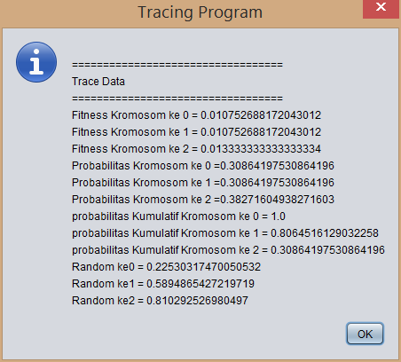

# Siwalga
Sistem Penjadwalan Mata Kuliah Menggunakan Algoritma Genetika.

## Input Mata Kuliah

## Input Dosen

## Input Ruang

## Input Selesai

## Generate Kromosom

## Informasi Optimasi

## Tracing Program
